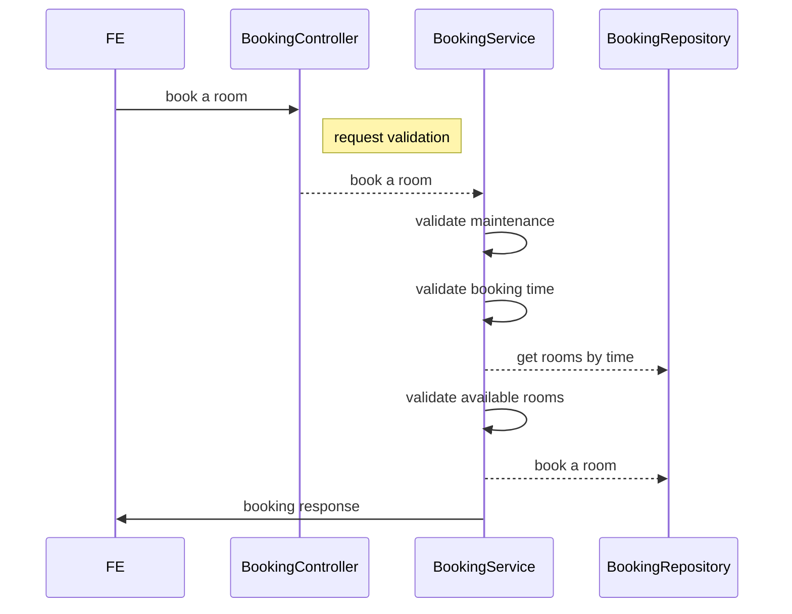

# Conference Room Booking API

## Introduction
This is a REST API for booking conference rooms within a company.

## Features

- Book a meeting room.
- List available meeting room.

## Technologies Used
- Java 17
- Spring Boot
- Spring Data JPA
- H2 Database
- Swagger for API documentation

## Setup Instructions

#### IDE
   > you can run the application using intellij
   > import the app and run [ConferenceRoomBookingServiceApplication.java](src%2Fmain%2Fjava%2Fcom%2Fmashreq%2Fbooking%2FConferenceRoomBookingServiceApplication.java)

#### DOCKER
   ````shell
    docker build --tag=conference-room-booking-service:latest .
    docker run -p8081:8080 conference-room-booking-service:latest
   ````

#### Maven
   ````shell
    git clone <repository-url>
    cd conference-room-booking
    mvn clean install
    mvn spring-boot:run
   ````
#### Running Tests
   ```sh
   mvn test
   ```

#### H2 Database console:
   ```sh
    http://localhost:8080/h2-console
    
    JDBC URL: jdbc:h2:mem:testdb
    User Name: sa
    Password: sa
   ```
#### Swagger UI for API documentation:
   ```sh
   http://localhost:8080/swagger-ui/index.html
   ```

## Project Structure
````
src/
├── main/
│   ├── java/
│   │   └── com/
│   │       └── mashreq/
│   │           └── booking/
│   │               ├── ConferenceRoomBookingApplication.java
│   │               ├── config/
│   │               │   └── SwaggerConfig.java
│   │               ├── controller/
│   │               │   └── BookingController.java
│   │               ├── dto/
│   │               │   └── BookingRequest.java
│   │               │   └── BookingResponseDto.java
│   │               │   └── AvailableBookingsResponseDto.java
│   │               ├── exception/
│   │               │   ├── GlobalExceptionHandler.java
│   │               │   ├── InvalidBookingRequestException.java
│   │               │   └── RoomNotAvailableException.java
│   │               │   └── ErrorMessage.java
│   │               ├── entity/
│   │               │   ├── BookingEntity.java
│   │               │   └── ConferenceRoomEntity.java
│   │               ├── repository/
│   │               │   └── BookingRepository.java
│   │               └── service/
│   │                   └── BookingService.java
│   ├── resources/
│   │   ├── db/
│   │   │   └── changelog/
│   │   │       └── db.changelog-master.yaml
│   │   ├── application.properties
│   │   └── logback-spring.xml
├── test/
│   └── java/
│       └── com/
│           └── yourcompany/
│               └── conferenceroombooking/
│                   └── BookingControllerTest.java
└── README.md
````

## Sequence Diagram



## API Endpoints

#### Postman Collection
[postman_collection.zip](https://github.com/MostafaMohamedRady/barak-banking/files/8599021/baraka-application.postman_collection.json.zip)

#### Book a Room

URL :-
````
http://localhost:8080/internal/v1/bookings
````
Request :-
````
{
  "attendees": 1,
  "startTime": "05:50",
  "endTime": "11:51"
}
````

Response :- 200
````
{
  "bookingReference": "1",
  "roomName": "Amaze",
  "startTime": "00:45",
  "endTime": "01:00",
  "numberOfPeople": 1,
  "status": "BOOKED"
}
````
Response:- Number of attendees must be at least 1
````
{
  "statusCode": "BAD_REQUEST",
  "timestamp": "2024-08-13T13:47:47.416+00:00",
  "message": "[FieldName:-attendees, ErrorMessage:-Number of attendees must be at least 1.]"
}
````
Response:- start time / end time error format
````
{
  "statusCode": "BAD_REQUEST",
  "timestamp": "2024-08-13T13:47:02.480+00:00",
  "message": "[FieldName:-startTime, ErrorMessage:-Start time must be in the format HH:mm]"
}
````

Response:- No available room
````
{
  "statusCode": "NO_ROOM_AVAILABLE",
  "timestamp": "2024-08-13T13:46:20.512+00:00",
  "message": "No available room for the specified time and attendees."
}
````
Response:- maintenance time
````
{
  "statusCode": "MAINTENANCE_TIME_ERROR",
  "timestamp": "2024-08-13T13:44:42.369+00:00",
  "message": "Booking cannot be done during maintenance time."
}
````
Response:- Booking Start Time must be lesser than End Time.
````
{
  "statusCode": "BOOKING_TIME_ERROR",
  "timestamp": "2024-08-13T13:55:50.735+00:00",
  "message": "Booking Start Time must be lesser than End Time."
}
````

Response:- intervals of 15 minutes.
````
{
  "statusCode": "BOOKING_TIME_ERROR",
  "timestamp": "2024-08-13T14:02:31.634+00:00",
  "message": "Booking time should given by the user in intervals of 15 minutes."
}
````

#### Get Available Bookings
URL:-
```
http://localhost:8080/internal/v1/bookings/available-rooms?startTime=00%3A00&endTime=00%3A30
```
Response:-
```
{
  "availableRooms": [
    {
      "roomName": "Amaze",
      "maxCapacity": 3
    },
    {
      "roomName": "Beauty",
      "maxCapacity": 7
    },
    {
      "roomName": "Inspire",
      "maxCapacity": 12
    },
    {
      "roomName": "Strive",
      "maxCapacity": 20
    }
  ]
}
```
### End


